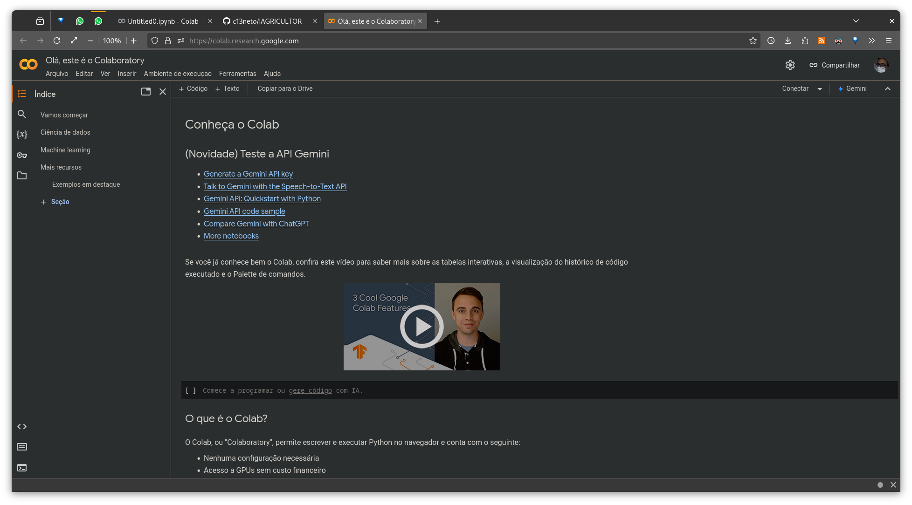
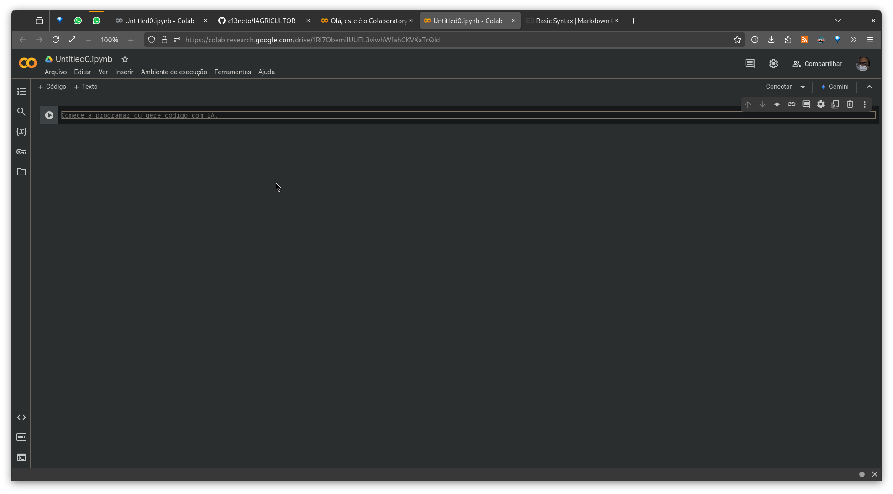
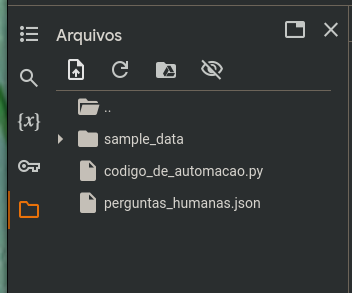

# IAGRICULTOR

### Escopo do projeto:

<dl>
  <dt> O IAgricultor é uma inteligência artificial (IA) focada no conhecimento da área de agricultura, com o objetivo de auxiliar fazendeiros no plantio e cultivo na região semiárida da Bahia. O agente será capaz de fazer recomendações, explicar técnicas, identificar problemas e melhorar o desempenho das plantações</dt>
</dl>

### O modelo foi:

- Treinado com Biblioteca da Embrapa
- Utilizado técnicas de fine-tuning e engenharia de prompt

### Utilização:

1. Utilize o [Colab Google](https://colab.research.google.com/) como máquina virtual para conseguir perfomance aceitavel.
   

   
2. Em seguida copie o seguinte código dentro do primeiro bloco:

```
!pip install colab-xterm pyexcel_ods
%load_ext colabxterm
%xterm
!curl -fsSL https://ollama.com/install.sh | sh
!nohup ollama serve &
```

3. Baixe o modelo desejado, no caso desse experimento foram:

   - llama3.2:1b

> O padrão do código de automação é o llama3.2:1b, caso queria trocar por outro modelo, troque-o na váriavel "model_name"
> Para baixar o modelo padrão, digite: ``!ollama pull llama3.2:1b``

4. Faça o upload dentro do notebook o codigo de automação junto com a base de perguntas e respostas para fazer o fine-tuning para adequar a inteligência artificial ao assunto: [Código de automação](https://github.com/c13neto/IAGRICULTOR/blob/main/codigo_de_automacao.py) | [Base de perguntas](https://github.com/c13neto/IAGRICULTOR/blob/main/perguntas_humanas.json)



5. Existe duas formas de conseguir executar o modelo:
   1. Copiando o código de automação dentro do bloco de automação e executando
   2. Executar a seguinte linha no bloco de código do notebook: ``!python3 codigo_de_automacao.py``
   3. Em seguida espere a base de dados interagir com o ollama até aparecer a caixa de mensagem
